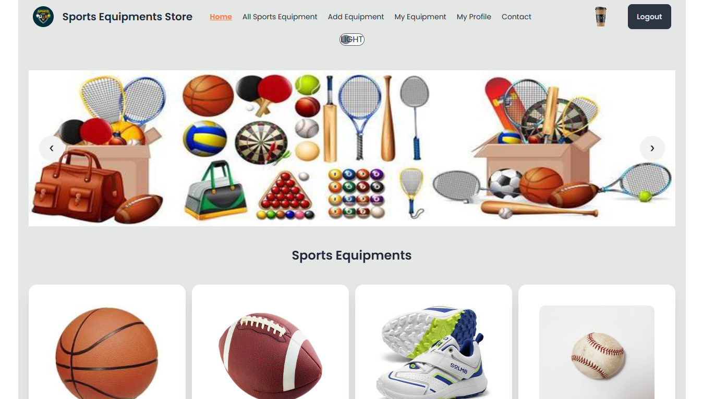

# Project Name is : Sports Equipments Store

## 5 Key Features :

- **Toggle Theme Change Button**:When a user wants to change the theme on this website, they can press the theme button. The website will then switch between dark and light modes.

- **Dynamic Routing**: A customer will be able to visit home ,My profile , All sports Equipments,add equipments etc page without reloading the page.

- **View Details**: When any person click view detailse btn , then he will go to the details page, where he can see the equipments details of that topic.

- **Private Route**:If a user not logged in, he can not visit Private Route such as , Profile page ,Add Equipments page,Update equipment page ETC. .User must be logged in ,if he wants to visit those routes.

- **Toastify Alert**: Whenever a user performs an action, such as login or sign in or logout, a Toastify alert pops up at the top of the screen. Each alert can display custom messages, such as "Successfully logged in" or "Error: create user is not successfully or Equipments added successfully ETC."

- **Dynamic Rendering Link**: When a new user want to register him, Then he will see  'Register' bellow the login form..When he Click it, he will go to register page.

- **REACT TOOLTIP And React Awesome REVEAL**: When a user moves his mouse on the theme change button then tooltip is working and in home page cards ,categories section and blogs are shows with react awesome reveal animations. 

- **2 More Section On Home Page**: In home page user will show our product category ,customers review and some blogs which is related this website .

- **Using React Awesome REVEAL**: Using React Awesome REVEAL to show the products  cards, sports categories and blogs. This features is so gorgeous .Users will enjoy this animation.

- **Using  REACT TOOLTIP**: Using  REACT TOOLTIP in theme change button and facebook,youtube and x link in footer.

## 🛠️ **Technology Stack**  

| **Category**         | **Technologies Used**                     |
|----------------------|-------------------------------------------|
| **Frontend**         | React, Vite, Tailwind CSS, DaisyUI        |
| **State Management** | React Query                               |                         
| **Routing**          | React Router DOM                          |
| **Backend**          | Firebase (Authentication)                 |
| **Notifications**    | React Hot Toast, SweetAlert2              |
| **Search & Sort**    | Match Sorter, Sort-By                     |
| **Deployment**       | *(Firebase, Netlify, etc.)*               |  

## **Dependencies**  

    "@emotion/react": "^11.13.5",
    "firebase": "^11.0.2",
    "localforage": "^1.10.0",
    "match-sorter": "^8.0.0",
    "react": "^18.3.1",
    "react-awesome-reveal": "^4.2.14",
    "react-dom": "^18.3.1",
    "react-icons": "^5.4.0",
    "react-router-dom": "^7.0.2",
    "react-toastify": "^10.0.6",
    "react-tooltip": "^5.28.0",
    "sort-by": "^1.2.0",
    "sweetalert2": "^11.14.5"
 
  ## Dev Dependencies
  
  
   - "@eslint/js": "^9.15.0",
   - "@types/react": "^18.3.12",
   - "@types/react-dom": "^18.3.1",
   - "@vitejs/plugin-react": "^4.3.4",
   - "autoprefixer": "^10.4.20",
   - "daisyui": "^4.12.14",
   - "eslint": "^9.15.0",
   - "eslint-plugin-react": "^7.37.2",
   - "eslint-plugin-react-hooks": "^5.0.0",
   - "eslint-plugin-react-refresh": "^0.4.14",
   - "globals": "^15.12.0",
   - "postcss": "^8.4.49",
   - "tailwindcss": "^3.4.15",
   - "vite": "^6.0.1"
  

## 1.Installation

Run `npm install` to install project dependencies.

## Usage

Run `npm run dev` to run the project locally.

## GITHUB REPOSITORY LINK (CLIENT SIDE) : https://github.com/Md-SayeedAlam/sports-equipment-client-side-repo-with-commit-

## GITHUB REPOSITORY LINK (SERVER SIDE) : https://github.com/Md-SayeedAlam/sports-equipment-server-side-repo-with-commit

## LIVE LINK : FIREBASE : https://sports-equipments-client.web.app/

## LIVE lINK: NETLIFY:   https://sports-equipments-sayeed.netlify.app/

## LIVE LINK : surge : https://sayeed-sports-equipments.surge.sh/